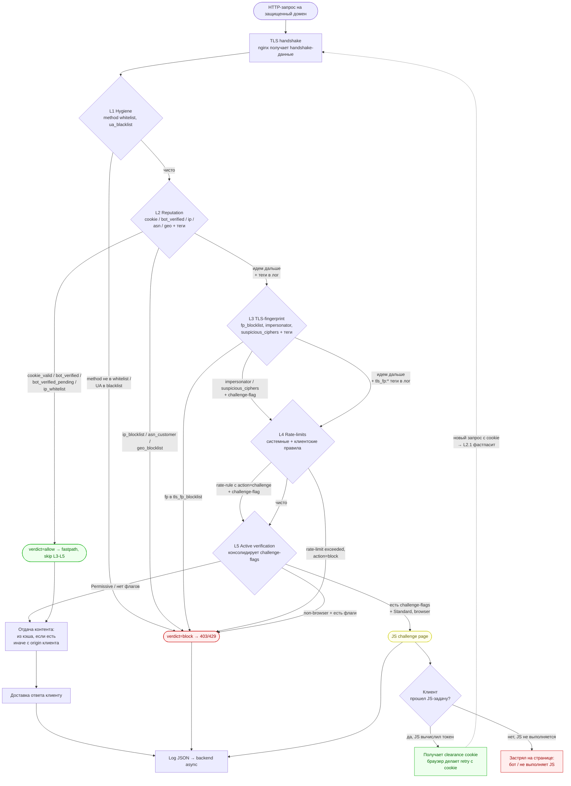
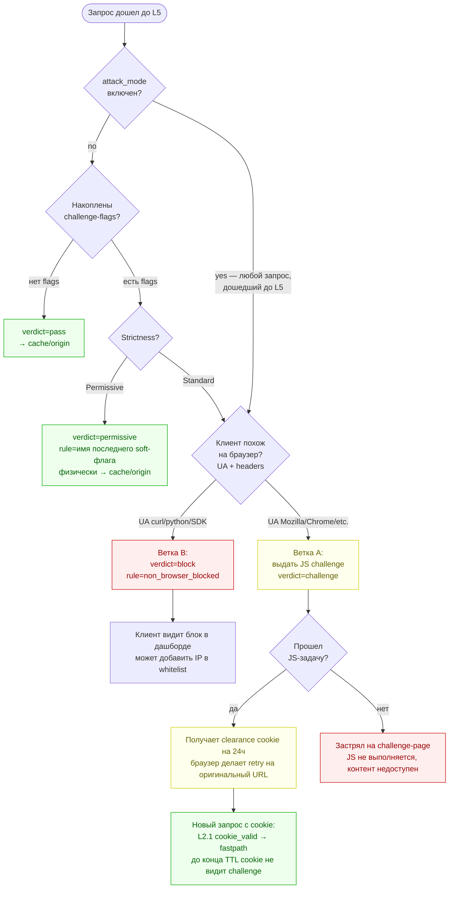
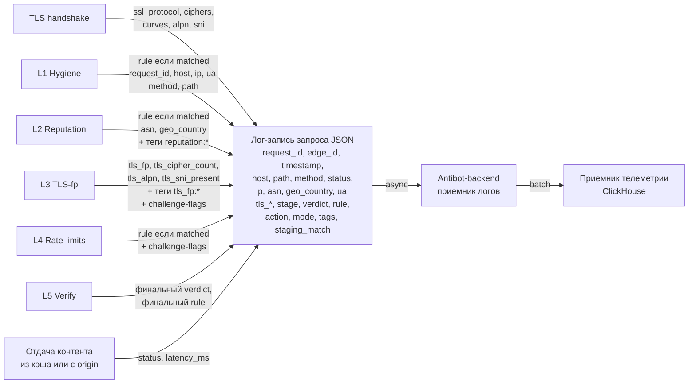

# Каскад Bot & Abuse Controls — схемы

Четыре комплементарные диаграммы, описывающие работу каскада. Каждая фокусируется на своем аспекте — все вместе дают полную картину. Источник правды по семантике — [vision.md](vision.md), эти схемы — визуальный комментарий к нему.

Диаграммы в формате Mermaid. Рендерятся в GitHub, GitLab, IDE с расширениями. Для Google Docs / PDF — экспортировать в PNG через mermaid.live или CLI.

---

## 1. Главный flow — путь запроса от приема до ответа

Высокоуровневый обзор. Показывает все слои каскада, терминальные состояния (block / allow / challenge), и куда уходит пропущенный трафик.

---

## 2. L5 decision tree — что именно решает финальный слой

Зум на самый сложный слой. Как L5 принимает решение о challenge vs pass vs block на основе накопленных сигналов.

---

## 3. Матрица «Что физически происходит» — mode × Strictness × verdict

Один и тот же verdict из каскада ведет к разным реальным действиям в зависимости от настроек ресурса.

| Verdict из каскада | `mode=shadow` *(бесплатный)* | `mode=active` + `Strictness=Permissive` | `mode=active` + `Strictness=Standard` |
|---|---|---|---|
| **`block`** (blocking-правило сработало) | Только лог | **403** (или 429 для rate-rule с Retry-After) | **403/429** |
| **`allow`** (allow-правило сработало) | Лог, каскад идет дальше | **Fastpath** — skip L3-L5 | **Fastpath** |
| **challenge-flag** (soft, накоплен) | Только лог (verdict=challenge при Standard / verdict=permissive при Permissive — dry-run) | `verdict=permissive`, → cache/origin | **JS challenge** (если браузер) / **403 `non_browser_blocked`** (если не браузер) |
| **`pass`** (ни одного срабатывания) | → cache/origin | → cache/origin | → cache/origin |

**Отдельно — `attack_mode` (тоггл поверх mode=active):**
- При `attack_mode=on` все запросы, дошедшие до L5 (т.е. не отбитые ранее и не пропущенные L2-allow), идут на challenge независимо от Strictness и флагов
- Verified search bots и держатели clearance cookie уходят в `allow` еще на L2 → до L5 не доходят → SEO под атакой не страдает

---

## 4. Data flow в лог — что и где накапливается

Каждый шаг каскада добавляет свои поля в одну итоговую JSON-запись лога. Финально она уезжает в backend асинхронно.

**Важные свойства:**
- Каждый запрос — ровно одна итоговая запись лога (не несколько)
- `verdict` и `rule` отражают последнее сработавшее правило, не все
- `tags` накапливаются — попадают все, что сработали по пути
- `challenge-flags` не уезжают в лог отдельным полем — они влияют на финальный `verdict` через L5
- Доставка лог-записи не блокирует hot-path запроса

---

## Что эти диаграммы НЕ показывают

Для полной картины смотри [vision.md](vision.md). Не вошло в диаграммы:

- **Фоновые процессы:** обновление каталогов от backend на edge, rDNS-воркер для bot_verified_ips, доставка логов с edge до приемника телеметрии, kill-switch механизм. Это все происходит параллельно основному flow и не показано на per-request диаграммах.
- **Staged rollout для PR-каталогов:** новые паттерны добавляются в `staging`-статус, матчатся и логируются (поле `staging_match`), но не влияют на verdict. После калибровки промоутятся в `active`.
- **Recovery loop для Branch B:** заблокированные non-browser запросы попадают в дашборд клиента, клиент может одним кликом добавить IP в whitelist.
- **Per-request input → output** для конкретных кейсов (Googlebot, curl, импersonator, реальный пользователь) — это уже сценарии тестирования, не схемы.
