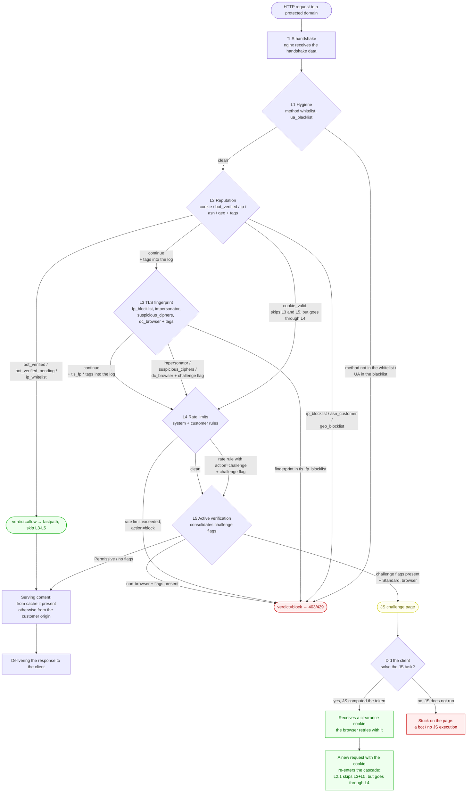
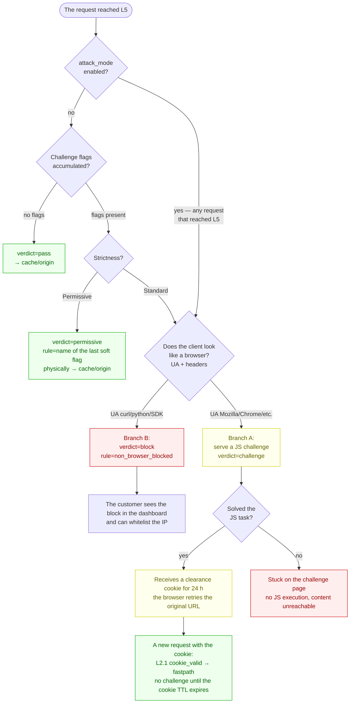
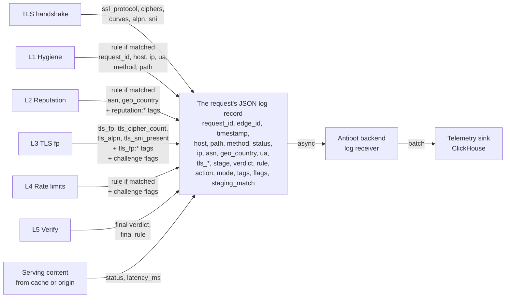
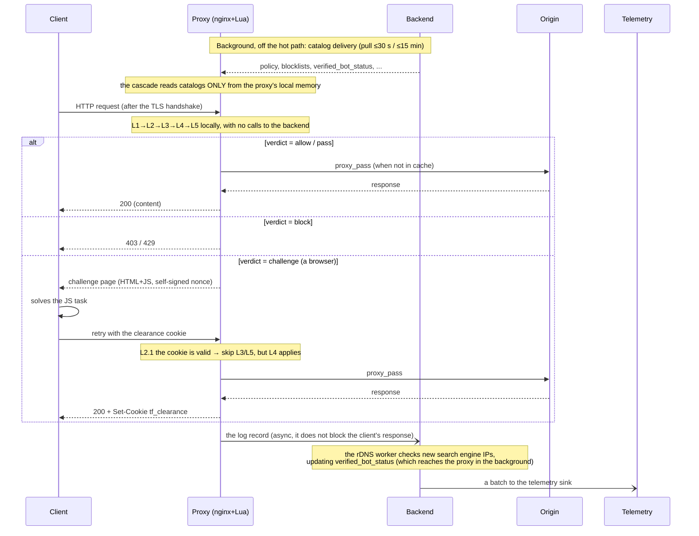
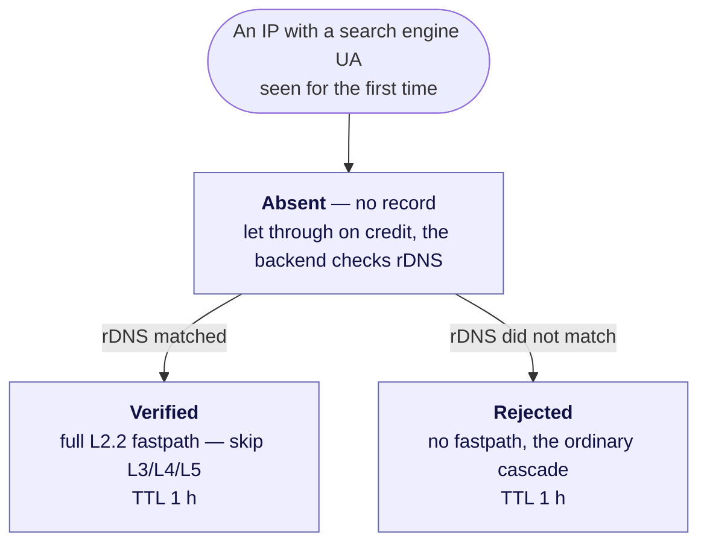

# The Bot & Abuse Controls cascade — diagrams

Six complementary diagrams describing how the cascade works: the main flow, the L5
decision tree, the mode × Strictness × verdict matrix, the data flow into the log, a
sequence diagram of the runtime interactions, and the state of a verified bot. Each
focuses on its own aspect; together they give the full picture. The source of truth for
the semantics is [vision.md](vision.md) — these diagrams are a visual commentary on it.

The diagrams are Mermaid. They render on GitHub, on GitLab and in IDEs with the right
extensions. For Google Docs or PDF, export them to PNG through mermaid.live or the CLI.

---

## 1. The main flow — a request's path from arrival to response

A high-level overview. It shows every cascade layer, the terminal states (block / allow /
challenge) and where the traffic that passes ends up.

> Logging is not shown on this diagram, to keep the layout readable: every terminal
> outcome (response delivery / `block` / `challenge`) writes exactly one log record. How
> the record is assembled is diagram #4, "Data flow into the log".

---

## 2. The L5 decision tree — what the final layer actually decides

A zoom into the most complex layer: how L5 decides between challenge, pass and block from
the accumulated signals.

---

## 3. The "what physically happens" matrix — mode × Strictness × verdict

The same verdict out of the cascade leads to different real actions depending on the
resource's settings.

| Verdict from the cascade | `mode=shadow` *(free)* | `mode=active` + `Strictness=Permissive` | `mode=active` + `Strictness=Standard` |
| --- | --- | --- | --- |
| `block` (a blocking rule fired) | Log only | **403** (or 429 with Retry-After for a rate rule) | **403/429** |
| `allow` (an allow rule fired) | Logged, the cascade continues | **Fastpath** — skip L3-L5 | **Fastpath** |
| **a challenge flag** (soft, accumulated) | Log only (verdict=challenge under Standard / verdict=permissive under Permissive — a dry run) | `verdict=permissive`, → cache/origin | **A JS challenge** (if a browser) / **403 `non_browser_blocked`** (if not) |
| `pass` (nothing fired) | → cache/origin | → cache/origin | → cache/origin |

**A note on the fastpath:** a full fastpath (skipping L3-L5) belongs to `bot_verified` /
`bot_verified_pending` / `ip_whitelist` only. `cookie_valid` is **partial**: it skips L3
and L5 but goes through L4 (rate limits apply to the cookie holder too).
`verdict=allow, rule=cookie_valid` is only set when L4 is clean; otherwise the L4 rule
wins.

**Separately — `attack_mode` (a toggle on top of mode=active):**

- Under `attack_mode=on`, every request that reaches L5 (that is, was not cut earlier and
  not let through by an L2 allow) goes to a challenge, regardless of Strictness and flags.
- Verified search bots and IP whitelist holders take the `allow` path back at L2 and never
  reach L5, so SEO is unaffected during an attack.
- Clearance cookies under attack: those issued before the attack started do not fastpath
  (they go to L5 for a challenge); those issued during the attack skip L3/L5 but still go
  through L4.

---

## 4. Data flow into the log — what accumulates and where

Each cascade stage adds its own fields to a single final JSON log record. The finished
record leaves for the backend asynchronously.

**Important properties:**

- Every request produces exactly one final log record, never several.
- `verdict` and `rule` reflect the last (terminal) rule that fired, not all of them.
- `tags` accumulate — everything that fired along the way lands there.
- `flags` accumulate — every challenge flag (from soft rules) along the way lands in this
  field, separately from the terminal `rule`.
- Delivering the log record does not block the request's hot path.

---

## 5. Sequence — runtime interactions over time

Who talks to whom during one request, and what happens in the background. The key point:
the backend is **not on the hot path** — the cascade reads only local catalogs, and the
backend participates only in the background (catalog delivery, log ingestion, rDNS).

---

## 6. State — the verified bot status (`bot_verification_status`)

The state machine of one IP with a search engine UA. Transitions are made by the
background rDNS worker; the TTL returns the record to "no data".

`Absent` is both "the IP's first appearance" and the state after the TTL expires: the
record is deleted and the IP is checked again on its next request. In `Absent` every
request is let through on credit (rule `bot_verified_pending`) — that is, leniently, before
the backend confirms or rejects the bot, so that SEO is not damaged.

---

## What these diagrams do NOT show

For the full picture see [vision.md](vision.md). Left out of the diagrams:

- **Background processes:** catalog delivery, the rDNS worker and log delivery appear in
  outline on the sequence diagram (#5) and the state diagram (#6); the details (the kill
  switch, pull frequencies, log buffering, persistence) are not covered — see vision.md.
- **Staged rollout for PR catalogs:** new patterns are added with `staging` status, match
  and are logged (the `staging_match` field) but do not affect the verdict. After
  calibration they are promoted to `active`.
- **The recovery loop for Branch B:** blocked non-browser requests appear in the customer's
  dashboard in a list of blocks, and the customer can whitelist the IP in one click.
- **Per-request input → output** for specific cases (Googlebot, curl, an impersonator, a
  real user) — those are test scenarios rather than diagrams.
